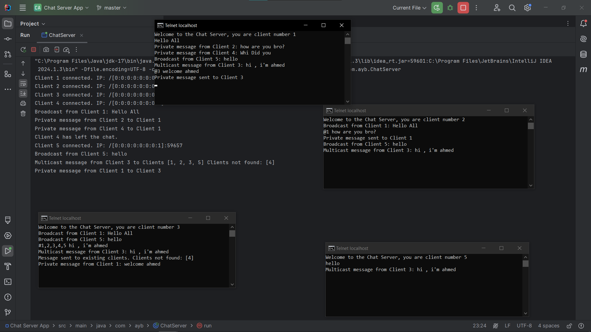

# Chat Server Description

This document provides an overview of the functionality of a simple multi-client chat server that supports various types of messaging such as broadcasting, private messaging, and multicast messaging. It is designed to handle multiple clients concurrently and ensures that client disconnections are managed smoothly.

### Key Functionalities:

- **Multi-client Handling**:  
  The server accepts multiple client connections and assigns a unique identifier to each client. It manages these clients in a thread-safe manner using a `CopyOnWriteArrayList`, allowing clients to join and leave without causing conflicts.

- **Private Messaging**:  
  Clients can send private messages to other connected clients using the format `@clientNumber message`. The server processes these messages and ensures they are sent only to the targeted client.

- **Multicast Messaging**:  
  Clients can send messages to multiple clients at once using the format `#client1,client2,... message`. The server checks for valid client numbers and delivers the message to the specified recipients.

- **Broadcast Messaging**:  
  Any message not prefixed with `@` or `#` is treated as a broadcast message. It is sent to all connected clients except the sender.

- **Client Disconnection**:  
  When a client disconnects, the server handles it gracefully by removing the client from the list and closing the connection.

### Architecture Overview:

- The server runs on a specific port (`1234` in this case), and clients can connect to it.
- Each client is handled by a separate thread (`ClientHandler`), which allows multiple clients to communicate simultaneously.
- Messages are transmitted using basic input/output streams.

### Demonstration

Below is an image that represents the flow of the chat server.

This image demonstrates how clients interact with the server and how messages are processed within the chat system.
